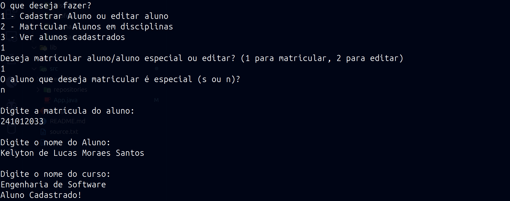
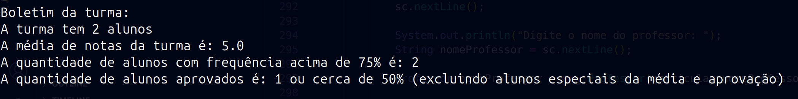

# Sistema Acadêmico - FCTE

## Descrição do Projeto

Desenvolvimento de um sistema acadêmico para gerenciar alunos, disciplinas, professores, turmas, avaliações e frequência, utilizando os conceitos de orientação a objetos (herança, polimorfismo e encapsulamento) e persistência de dados em arquivos.

O enunciado do trabalho pode ser encontrado aqui:

- [Trabalho 1 - Sistema Acadêmico](https://github.com/lboaventura25/OO-T06_2025.1_UnB_FCTE/blob/main/trabalhos/ep1/README.md)

## Dados do Aluno

- **Nome completo:** Kelyton de Lucas Moraes Santos
- **Matrícula:** 241012033
- **Curso:** Engenharias
- **Turma:** 06

---

## Instruções para Compilação e Execução

1.  **Compilação:**

    Clone todo este repositório com o comando `git clone`.
    Em seguida abra o terminal na raiz desse repositório e rode o comando:

    >

          javac -d out @source.txt

    >

2.  **Execução:**

    Para executar utilize o comando:

    >

           java -cp out App

    >

    Também funciona pelo botão de execução do VScode.

3.  **Estrutura de Pastas:**

```bash
   ├── src
   ├── App.java
   ├── entidades
   │   ├── AlunoEspecial.java
   │   ├── Aluno.java
   │   ├── Disciplina.java
   │   ├── ENUM
   │   │   ├── MetodoDeAvaliacao.java
   │   │   └── Modalidade.java
   │   ├── HorarioDeAula.java
   │   ├── Professor.java
   │   ├── TurmaAluno.java
   │   └── Turma.java
   └── repositories
       ├── AlunoEspecialRepository.java
       ├── AlunoRepository.java
       ├── DisciplinaRepository.java
       ├── ProfessorRepository.java
       ├── TurmaAlunoRepository.java
       └── TurmaRepository.java
 csv_files
   ├── Aluno.csv
   ├── AlunoEspecial.csv
   ├── Disciplina.csv
   ├── Professor.csv
   ├── TurmaAluno.csv
   └── Turma.csv

```

4.  **Versão do JAVA utilizada:**  
    A versão do java utilizada foi `java 21`

---

## Vídeo de Demonstração

- [Inserir o link para o vídeo no YouTube/Drive aqui]

---

## Prints da Execução

1. Lista de alunos cadastrados:
   

2. Cadastro de Aluno:  
   

3. Relatório de Frequência/Notas da turma:  
   

4. Relatório de Frequência/Notas individual:
   

---

## Principais Funcionalidades Implementadas

- [x] Cadastro, listagem, matrícula e trancamento de alunos (Normais e Especiais)
- [x] Cadastro de disciplinas e criação de turmas (presenciais e remotas)
- [x] Matrícula de alunos em turmas, respeitando vagas e pré-requisitos
- [x] Lançamento de notas e controle de presença
- [x] Cálculo de média final e verificação de aprovação/reprovação
- [x] Relatórios de desempenho acadêmico por aluno, turma e disciplina
- [x] Persistência de dados em arquivos (.txt ou .csv)
- [x] Tratamento de duplicidade de matrículas
- [x] Uso de herança, polimorfismo e encapsulamento

---

## Observações (Extras ou Dificuldades)

- [Espaço para o aluno comentar qualquer funcionalidade extra que implementou, dificuldades enfrentadas, ou considerações importantes.]

---

## Contato

- kelytonlucas@gmail.com
